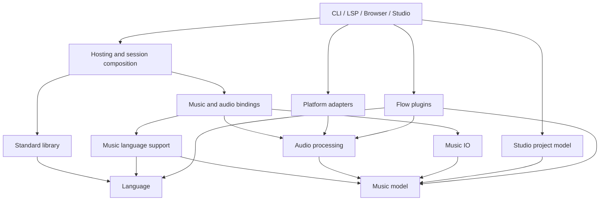

# Flow restructuring and focused DAW roadmap

Date: 2026-09-20  
Status: Implementation active; Phases 0–4 complete, Phase 5 in progress (2026-09-27).
Scope: Preserve Flow's personality, establish an independently usable programming language, and build a focused music workstation on a shared music-processing backend.

Navigation: [Direction](#1-direction) · [Language contract](#2-preserve-the-language-before-moving-it) · [Current debt](#3-starting-point-and-evidence) · [Architecture](#4-target-architecture) · [Modules](#5-modules-compatibility-and-general-purpose-use) · [Sessions and analysis](#6-sessions-analysis-and-cancellation) · [Audio](#7-music-processing-and-audio-architecture) · [Flow plugins](#8-plugins-written-in-flow) · [DAW workflow](#9-focused-conventional-daw-scope) · [Phases](#10-migration-phases-and-completion-gates) · [Verification](#11-verification-strategy-and-measurable-targets) · [First tickets](#12-work-organization-and-first-implementation-tickets) · [Decisions](#13-decisions-to-record-before-their-dependent-work) · [Effort and risk](#14-effort-risk-and-scope-control) · [Completion](#15-completion-checklist) · [Agent orchestration](#16-agent-orchestration-playbook).

## Implementation status — 2026-09-27

| Phase | Status | Outcome / next gate |
| --- | --- | --- |
| 0–1 Baseline and contracts | Complete | Reproducible verification, executable contracts and dependency rules. |
| 2 Session/job isolation | Complete | Session-owned services, cancellation, job coordination and process isolation. |
| 3 Language extraction | Complete | Independent BCL-only language artifact, CLI/REPL/embedding proof. |
| 4 Analysis and tooling | Complete | Non-executing check, shared editor metadata/analysis and explicit host adapters. |
| 5 Music model/offline rendering | In progress | Detached scores and linear legacy assembly verified; isolated sine rendering, streaming native WAV and snapshot MIDI export (legacy-byte parity) implemented. Full instrument/effect migration, rerouting legacy consumers and shared editing transforms remain open. |
| 6 Audio engine/UI prototypes | Not started | Block engine, transport, measured managed/native choice, responsive shell. |
| 7 Flow plugins | Not started | Public graph authoring, lifecycle, bounded compilation and hot reload. |
| 8 Project/piano roll | Not started | Editable notes, arrangement, undo, save/reopen and plugin integration. |
| 9 Complete DAW workflow | Not started | Routing, recording, clips, automation, export and Linux packaging. |
| 10 Hardening/release | Not started | Stress/recovery tests, compatibility docs and reproducible releases. |

The [progress ledger](progress/flow-restructuring.md) records commits and evidence.
Continue from the [Phase 5 handoff](handoffs/2026-09-27-phase5-in-progress.md).
Later phase descriptions below remain planned work, not shipped capabilities.

## 1. Direction

Flow should be an expressive programming language with first-class musical capabilities. A user writing a collection transform, a small program, or a generative algorithm should not need an audio installation. A musician should still have the compact notation, musical types, composition tools, and forgiving behavior that make Flow distinctive.

The DAW should consume Flow's music-processing components through explicit APIs. The CLI, REPL, language server, browser playground, and DAW should be hosts of the same language rather than separate implementations of its behavior.

This is an incremental restructuring, not a language redesign or a rewrite in another implementation language. Keep C# and the existing interpreter initially. Preserve working musical algorithms and examples. Replace architectural boundaries where they prevent isolation, predictable execution, or interactive processing.

### Planning assumptions

- Confirmed direction: a conventional DAW with piano-roll editing as a priority, and plugins authored in Flow.
- Confirmed first platform: Linux desktop.
- Ordinary MIDI/note clips are edited directly in the project document. Writing a Flow program is optional for composing in the DAW.
- Flow instruments and real-time effects are part of the first useful workstation. Third-party native plugin formats are outside the initial scope; Flow is the plugin authoring language.
- Include MIDI keyboard input and basic MIDI recording in the first usable DAW. Multitrack audio recording/monitoring is a follow-on milestone unless scope is explicitly expanded.
- Keep the existing browser playground working. Browser support for the new DAW is a separate release decision.
- Preserve existing scripts through an explicit compatibility path. Do not silently redefine Flow while moving its code.
- New API and project names below are proposals. Examples of future APIs or commands are specifications to implement, not existing commands.

### Outcomes that define success

1. A minimal host runs useful non-musical Flow programs without referencing music, audio, native device libraries, or sample assets.
2. Existing music programs run through a compatibility host with documented behavior and representative audio regression coverage.
3. Two engines can evaluate and render concurrently without sharing mutable state or redirecting process-wide console streams.
4. Analysis never executes user code, opens devices, or writes files.
5. A failed or superseded live edit cannot replace newer output or leave uncontrolled background workers.
6. The DAW can edit piano-roll clips and play Flow-authored instruments/effects while Flow evaluates another version in the background.
7. A project reopens with its source, arrangement, parameter values, asset references, and deterministic generation settings intact.

## 2. Preserve the language before moving it

Write a small, executable language contract before large refactors. The purpose is to retain the unusual combinations the author values, including interactions between features.

| Area | Behavior to characterize and preserve |
|---|---|
| Calls and composition | Prefix arithmetic; parenthesized and optional-parenthesis calls; `->`; tuple-unpacking `~>`; intermediate `as` bindings; variable/function name resolution. |
| Procedures | Implicit return collection, explicit returns, zero/one/multiple returned values, recursion, overload selection, named arguments, varargs. |
| Functional behavior | Lambdas, captures, lexical variable scope, higher-order functions, lazy values, cached exceptions, pattern matching and guards. |
| Data | Numeric types and widening, symbols versus strings, tuples, structural equality where promised, arrays, negative indexing, dictionaries and insertion order. |
| Ergonomics | Optional separators, interpolation, plural type shorthand, comment forms, line continuation, diagnostic spans. |
| Forgiving semantics | Exact coercion, clamping, fallback, advisory, and strict-mode rules. Distinguish intentional generosity from accidental inconsistent behavior. |
| Modules | Import idempotence, relative resolution, cycles, qualified access, legacy unqualified exports, duplicate names, per-file pragmas. |
| Music | Note/chord/stream syntax, duration units, tuning, context inheritance, section calls, voices, seeded generation, transforms, output timing. |

Each contract entry should contain a short program, expected result or diagnostic, rationale, and compatibility status. Include non-musical examples prominently. Do not use phase numbers as the primary explanation of semantics.

Important boundaries:

- Refactoring must not turn prefix Flow into a conventional infix language, make all syntax stricter, or remove implicit returns for implementation convenience.
- Do not assume all behavior labeled "charitable" must remain forever. Preserve it initially; make disputed behavior a separate, reviewable semantic decision.
- Do not equate annotations with a complete static type-checker. The current implementation performs substantial checking during execution. Document what analysis can prove and what remains runtime-checked.
- Do not generalize the language with classes, macros, a package marketplace, or a new VM as prerequisites for this work.

Suggested first non-musical examples: a collection-processing script, dictionary aggregation, tuple pipelines, recursive tree processing, a lazy computation, pattern-based dispatch, and a two-module utility program. Use existing capabilities; record gaps instead of silently adding new language features.

## 3. Starting point and evidence

The September review found roughly 64,000 lines of core C# and 67,000 lines in the main test project, including comments. There is substantial implementation and regression coverage to retain.

Observed verification from that review:

- Main suite: 2,753 passed, 9 failed, 19 skipped, 2,781 total.
- Eight failures were terminal-color tests. Both affected groups passed when rerun without the environment's `NO_COLOR` setting.
- One failure expected an unknown vowel to throw while the implementation returns a fallback with an advisory.
- MIDI suite: 19 passed and 2 failed. Tests expect tracks to remain intact while current conversion splits melodic material into hand/voice tracks.
- These numbers describe one local run, not a clean CI baseline or validation of every native backend.

Specific starting points for the migration:

| Current location | Coupling or debt | Planned destination/action |
|---|---|---|
| `flow-lang/Core/FlowEngine.cs` | Constructs audio/sample services and eagerly registers music functions; publishes static current caches/context. | Host composition plus isolated language sessions; compatibility facade during migration. |
| `Runtime/ExecutionContext.cs`, `Runtime/StackFrame.cs` | Language execution state includes musical context and domain registries. | Language scope state plus separately owned music evaluation state. |
| `Runtime/Value.cs` | General values directly name musical and audio implementations. | Generic value representation; domain factories and bindings outside the language package. |
| `Parsing/TypeParser.cs`, `Ast/*` | Parsing binds concrete runtime types; several AST nodes carry `FlowType`. | Syntax-level type references followed by explicit binding. |
| `Interpreter/ExpressionEvaluator.cs`, `Interpreter/Interpreter.cs` | Core dispatch understands musical construction and domain member access. | Keep language operations local; route the existing music nodes through a bounded binding interface. |
| `StandardLibrary/BuiltInFunctions.cs` | Large mixed registration surface and special registration ordering. | Module-owned descriptors and explicit host composition. |
| `flow-lang/std.flow` | Imports `@bars` and declares musical conversions. | Pure standard-library surface plus legacy aggregate exports. |
| `Runtime/ModuleLoader.cs` | Resolution, file access, execution, target checks, and module state intertwined. | Source resolver, descriptor discovery, analysis, and execution as separate operations. |
| `Diagnostics/RenderingDiagnostics.cs`, `Runtime/FlowConfig.cs` | Process-wide warning deduplication and active configuration. | Session/job-owned diagnostics and immutable configuration snapshots. |
| `Runtime/WasmEntry.cs`, `StdLib.Print`, CLI hosts | Shared engine/backend state and console-based output capture. | Explicit session lifetime and per-session output sinks. |
| `StandardLibrary/Audio/SongRenderer.cs` | Whole-song assembly repeatedly appends and copies accumulated audio. | Sized/chunked offline assembly first; shared block renderer later. |
| `StandardLibrary/Audio/NoteSynthesizer.cs`, `Audio/DSP/*` | Full-note/full-buffer processing interfaces. | Preserve offline APIs; add stateful block processors progressively. |
| `flow-interpreter/LiveReloadManager.cs` | Render timeout abandons workers; live reload sits in a CLI assembly. | Host-independent job coordinator and bounded evaluation workers. |
| `flow-cli/Commands/CheckCommand.cs` | Advertised analysis runs the program. | Shared non-executing analysis API with honest diagnostics. |
| `.github/workflows/` | No general checked-in PR build/test workflow found. | Continuous language, music, host, and platform validation tiers. |
| `global.json` | SDK version `10.0.0` is reported invalid by installed SDK tooling. | Select and validate a real SDK feature-band version and deliberate roll-forward policy. |
| `docs/ARCHITECTURE.md`, historical plans | Useful explanations mixed with outdated counts, dependencies, and behavior claims. | Refresh current architecture after each migration; preserve history separately. |

The existing [DAW design](2026-02-14-daw-features-design.md) and [implementation plan](2026-02-14-daw-features-implementation.md) describe earlier musical feature work. Retain them as history. This document governs the proposed restructuring; it does not imply those earlier plans were never implemented.

## 4. Target architecture

### 4.1 Dependency rules

Use these as logical boundaries first. Extract physical assemblies when the corresponding dependency boundary is real and testable. Do not create a dozen projects filled with forwarding wrappers on the first day.

| Logical component | Responsibilities | May depend on |
|---|---|---|
| `Flow.Language` | Source locations, syntax, parser, binder/analyzer, core types/values, interpreter, lexical scopes, extension contracts. | BCL; small justified language-only dependencies. No music model, DSP, device, UI, or host references. |
| `Flow.StandardLibrary` | Numbers, strings, arrays, tuples, dictionaries, higher-order operations, core modules; output via an injected sink. | Language. |
| `Flow.Music.Model` | Host-neutral notes, sequences, arrangements, tempo maps, tuning descriptions, stable musical identities. | BCL. No AST, closures, `Value`, audio devices, or interpreter context. |
| `Flow.Music.Language` | Musical types and syntax evaluation; scoped musical context; composition functions; lowering to the music model. | Language, StandardLibrary as needed, Music.Model. |
| `Flow.Audio` | Audio buffers, DSP state, synthesis/sampling, prepared rendering graphs, offline/block rendering. | Music.Model as needed; audio-specific libraries only. No interpreter or UI. |
| `Flow.Music.IO` | MIDI and notation import/export, codec adapters, asset loading. | Music.Model and relevant audio contracts. Keep native device dependencies in platform adapters. |
| `Flow.Music.Bindings` | Flow-callable render/play/export/record bridges and legacy audio builtins. | Language, Music.Language, Audio, IO; abstract host services. |
| `Flow.Plugins` | Flow plugin definitions, graph-building API, validation/lowering, parameter/state contracts, plugin worker coordination. | Language, music bindings/model, declarative Audio graph contracts. No UI references. |
| `Flow.Platform.*` | Device access, native audio/MIDI bindings, desktop/browser platform adapters. | Audio/IO contracts; appropriate native packages. |
| `Flow.Hosting` | Session builders, configured module catalog, compatibility facade, lifecycle, evaluation job coordination. | Selected language/music components. Concrete device selection belongs in the application composition root. |
| `Flow.Studio.Model` | Project document, clips, track routing, parameters, commands/undo, serialization and migrations. | Music.Model and declarative render contracts. No live interpreter/session objects. |
| CLI, LSP, browser host, Studio application | User interaction, composition of capabilities, UI, process boundaries. | Only the components each application needs. |

Dependency arrows below mean "depends on":



Eventually offer a small language-only distribution and a complete music distribution. Do not publish every logical component as a separate public package during the initial refactor. Internal APIs can settle first.

### 4.2 One grammar, optional music execution

Recommended first implementation: keep Flow's existing grammar in the language frontend, including lightweight syntax representations for musical constructs. These nodes are source descriptions only; recognizing a note stream must not initialize music or audio services.

- Replace parser references to concrete domain runtime types with type-name/type-argument syntax records. Bind names using the active module/type catalog.
- A language-only host can parse a music construct and report that the required module is unavailable during analysis/evaluation.
- Ordinary non-musical programs have no dependency on the music model or renderer.
- Importing a module does not retroactively change tokenization halfway through a file.
- Preserve existing reserved words and note-like identifier rules initially. Reclaiming names such as note-looking identifiers is a language-version decision, not a hidden consequence of a smaller installation.
- Use a small, explicit interface to handle the existing music expression/statement families. Do not build a general parser-plugin framework as a prerequisite.

This deliberately separates runtime optionality from grammar minimalism. If a future tiny distribution must exclude music grammar entirely, evaluate that as a later packaging feature with its own parser compatibility matrix.

### 4.3 Remove domain dependencies from language values

- Keep `Value`, primitive types, equality, and general overload machinery in Language.
- Move `Value.Note`, `Value.Song`, `Value.Buffer`, and similar factories to domain binding helpers. Legacy wrappers can delegate while callers migrate.
- Register domain type descriptors, conversions, member access, formatting, and constructor-pattern support through bounded interfaces.
- Core numeric conversions must not name every music type. Music bindings own unit conversions involving their types.
- Preserve overload ranking and strict-mode behavior before attempting to simplify them. Add ambiguity tests before replacing numeric specificity scores.
- Do not replace concrete types with unchecked strings everywhere. Domain values remain typed; extension registration is validated for duplicate identities and incompatible signatures.
- Keep type identity stable across repeated session creation. Any move away from CLR-type identity needs explicit generic-type, equality, dictionary-key, and overload tests.

### 4.4 Separate musical results from executable definitions

Current `SectionData` includes parameter patterns, default expressions, and AST bodies. That object cannot serve as the DAW's durable song model.

Create distinct concepts:

- A music-language section definition can retain syntax, parameters, and closures inside an evaluation session.
- Evaluating it produces notes, events, clips, and arrangement data with resolved musical values.
- The resulting music model contains no execution context, lambda closure, device handle, or mutable sample buffer.
- The renderer consumes an immutable snapshot or explicitly owned prepared representation.
- A DAW project stores source and source parameters alongside generated results/provenance. It does not serialize runtime object graphs.

## 5. Modules, compatibility, and general-purpose use

### 5.1 Distinguish four mechanisms

1. **Package availability:** which implementations are installed in the host.
2. **Module import:** which declarations a script uses and how their names resolve.
3. **Host capabilities:** which side effects the host permits/provides, such as output, files, devices, or network access.
4. **Language compatibility:** which documented semantic version a script/project expects.

Keep these independent. A source `use` statement cannot grant an audio device the host does not provide. Strict mode controls language behavior, not capability permissions. Platform support should be represented as capabilities rather than scattered `IsWebTarget` branches in semantic code.

### 5.2 Standard-library split

- General modules contain collections, strings, math, function helpers, and generic algorithms. `@std` should ultimately be useful without importing `@bars`.
- Musical modules contain notation, harmony, arrangement, tuning, patterns tied to musical sequences, rendering, and musical IO.
- Classify generative algorithms by actual dependencies. A generic Markov model or L-system may belong outside music, while sequence conversion and scale-aware improvisation remain musical. Do not force all of `@generative` into either bucket without inspection.
- Keep existing public import paths working in compatibility mode. Separate implementation ownership from user-facing module names.
- Audit direct builtin access and transitive exports. Removing `@bars` from `@std` is a breaking behavior change even if all functions still exist elsewhere.

Use a module descriptor with stable identity, exported symbols/types, parameter names, documentation, implementation bindings, and capability requirements. During migration, either generate signature declarations from it or validate existing `.flow` declarations against it. Choose one authoritative signature source; do not keep two hand-maintained catalogs.

The LSP and documentation generator read descriptor metadata without invoking implementations or constructing dummy audio engines.

### 5.3 Compatibility rollout

| Surface | Initial migration behavior | New explicit behavior |
|---|---|---|
| Existing CLI invocations | Preserve legacy complete music environment and imports. | Add a documented language-only host/profile. |
| Existing `@std` semantics | Preserve transitive musical exports through a legacy aggregate. | Pure standard library in the new module profile. |
| Existing source syntax | Preserve parsing and evaluation quirks. | No syntax redesign required. |
| Existing C# `FlowEngine` consumers | Keep a delegating facade where practical. | Session builder and typed service APIs. |
| Browser `run/play/stop/dispose` | Preserve public behavior through an adapter. | Explicit session ownership internally. |
| Existing rendered output | Preserve selected baseline render paths. | New block renderer has declared compatibility/tolerance rules. |

Persist the chosen language/module profile in future Studio projects. The CLI must choose one documented default for unversioned files; keep it legacy-compatible during migration. Do not guess from filenames or execute the program to discover its profile. Announce a future default change separately with migration diagnostics and examples.

### 5.4 General-purpose capabilities

The initial language-only goal is a useful language, not an immediate replacement for Python's ecosystem. Make current facilities coherent before broadening them.

- Printing writes to the host's output sink; a CLI sink normally points at stdout.
- Imports resolve through injected source providers with stable source IDs and explicit base paths, not process-wide CWD changes.
- File IO, clocks, environment access, and external processes, where present or later added, use host-provided services.
- Host budgets cannot be raised by a script calling `setMaxIterations`; that function may only adjust within the host's ceiling.
- Time/units need a classification decision: determine whether seconds and milliseconds become general quantities while notes, beats, and tuning remain musical. Preserve existing literal meanings until this is decided.
- Add a non-musical tutorial and examples that do not mention tempo, tracks, or audio setup.

## 6. Sessions, analysis, and cancellation

### 6.1 Ownership model

An application owns sessions. A session owns scopes, module state, output sinks, diagnostics, random state, and optional music evaluation state. A render job owns its prepared graph and mutable DSP state. The device host owns the audio device. Asset caches can be shared only through an explicitly designed immutable-data service with bounded lifetime and eviction.

Remove process-global mutable state from these paths:

- `FlowEngine.CurrentSampleCache`, `CurrentSfzSampleCache`, and `CurrentExecutionContext`.
- Active configuration, warning deduplication, synthesis RNG resets, current tempo, and incidental static render controls.
- Global console redirection for capturing output.
- Shared WASM sessions whose lifetime is implicit rather than tied to the host instance.

Audit `static`, `ThreadStatic`, and `AsyncLocal` field-by-field. Constants and immutable tables are fine. `AsyncLocal` is not a substitute for explicit ownership, particularly across background jobs.

One session executes serially unless an API explicitly documents otherwise. Concurrent independent sessions are required. Do not make every dictionary concurrent and call the interpreter thread-safe.

### 6.2 Proposed host API shape

Expose distinct operations, with names finalized during implementation:

```text
Parse(source, syntaxOptions) -> SyntaxTree + diagnostics
Analyze(tree, moduleMetadata, analysisOptions) -> AnalysisResult
Evaluate(treeOrBoundProgram, session, cancellation) -> EvaluationResult
CompileMusic(valueOrExports, musicOptions) -> CompositionSnapshot
PrepareRender(composition, assets, renderOptions) -> PreparedRender
RenderOffline(preparedRender, outputSink, cancellation) -> RenderResult
```

`EvaluationResult` should distinguish success, invalid program, cancellation, budget exhaustion, missing capability, and host failure. User diagnostics have stable codes and spans. Internal failures preserve debugging information for the host without masquerading as user type errors.

### 6.3 Non-executing analysis

- Reuse the same frontend in CLI, REPL, LSP, and Studio.
- Analyze declarations, lexical resolution, known calls, argument names/arity, and provable type compatibility without executing procedures or module initializers.
- Discover imported module signatures through source analysis or descriptors, not evaluation.
- Mark unresolved/dynamic cases honestly. Do not claim full static assurance before it exists.
- `flow check` uses analysis only. Add a separate explicit execution check if needed; do not preserve execution under the misleading old command description.
- Lexing/parsing/analysis support cancellation, depth limits, and source-size limits suitable for interactive editing.
- Cache source trees and metadata by content/version; never reuse mutable interpreter state as an analysis cache.

### 6.4 Cancellation and job replacement

- Thread cancellation through evaluation entry points, loop backedges, function boundaries, long builtin operations, module work, asset loading, and offline render chunks.
- Cancellation and budget errors must not be swallowed by charitable fallback catches.
- Use a latest-request-wins coordinator: at most one active evaluation and one replacement request per document, with generation IDs on results.
- Cancel superseded work, await its termination, and dispose its resources. Reject stale results even when cancellation arrives late.
- Publish a new successful composition/render snapshot atomically. Keep the last known good version when evaluation fails.
- Cooperative cancellation cannot terminate arbitrary blocking/native code. If a host promises a hard stop, execute evaluation in a worker process that can be terminated and restarted. Preserve the audio host outside that worker.
- A timeout test must verify the worker actually exits or is terminated; checking the wording of its advisory is insufficient.

Capability restrictions in an in-process managed interpreter are not a claim of security isolation. Treat third-party native code and a future plugin host as separate boundaries.

## 7. Music processing and audio architecture

### 7.1 Two intermediate representations

Introduce two explicit representations instead of making the AST or final WAV carry every concern:

1. **Composition snapshot:** tracks/parts, note events, arrangement, tempo/time-signature map, instrument assignments, parameter descriptions, source provenance, and generation settings.
2. **Prepared render graph:** validated routing, scheduled events, preloaded assets, allocated node state, sample-rate configuration, and bounded processing buffers. Flow plugin definitions lower into nodes/subgraphs in this representation.

The composition is editable/inspectable data. The prepared graph is execution-ready state owned by the renderer. Neither runs arbitrary Flow callbacks on the audio thread.

### 7.2 Timing and identity contracts

- Store score timing in a precise beat/rational representation where required; preserve tuplets and overlaps. Specify units explicitly rather than scattering `double` values with implied meanings.
- Use a single documented beat-to-sample conversion over the tempo map. Define rounding, event ordering at equal times, and loop/seek boundaries.
- Preserve per-note pitch, cents/tuning, velocity, duration, onset offset, articulation, voice identity, and instrument routing when lowering.
- Define tempo-ramp behavior and time-signature changes explicitly. A meter change does not by itself redefine elapsed time.
- Use stable IDs for Studio tracks, clips, parameters, and explicit source outputs. AST line numbers alone are not durable identity.
- Store random seeds and generation versions. Existing source-location-derived randomness stays in the legacy path; migrating it to stable IDs is a visible reproducibility decision.
- Internal note scheduling uses sample positions/within-block offsets. External MIDI device timing is measured and reported separately; do not promise hardware sample accuracy from a software timestamp.

### 7.3 Keep offline rendering useful throughout

First fix repeated song concatenation by precomputing sizes where possible or writing chunks to an output sink. Add cancellation and progress. Audit effect chains for needless full-buffer copies.

Keep existing full-buffer APIs available for scripts and offline processing. Port internals incrementally rather than requiring every synth and effect to become real-time before anything ships.

Compatibility has two distinct levels:

- Deterministic repeated output for the same input, seed, engine version, and declared platform contract.
- Compatibility with an older render algorithm's output.

Do not conflate them. Retain selected byte-identical legacy tests. For intentionally changed algorithms or processing order, use musical-event equivalence plus appropriate RMS, spectral, duration, and tail tests. Record approved baseline changes; never re-record all fixtures simply to make a refactor pass.

### 7.4 Stateful block processing

A processor contract should include preparation, reset/seek behavior, bounded block processing, parameter updates, tail/latency metadata, and disposal outside the callback. Final signatures are designed after the prototype.

Initial node set:

- Cached audio clip playback with resampling prepared/configured off the audio thread.
- Gain/pan with smoothing, summing/mixing, and output metering.
- One oscillator voice implementation and one sampler path.
- Filter and delay with persistent state; reverb next.

Later nodes can adapt existing algorithms. Arbitrary Flow lambda instruments and whole-buffer transforms remain available through background rendering/frozen clips until there is a separately validated real-time execution model.

Real-time rules:

- No interpreter evaluation, asset loading, file/network access, console output, blocking waits, or unbounded locks in processing callbacks.
- Preallocate processing memory; avoid allocation and managed finalization work in the callback path.
- Prepare graphs off-thread. Publish at a known block or musical boundary, keep old resources alive until the callback no longer uses them, and retire/dispose them off-thread.
- Use bounded event/command queues with documented overflow policy. Coalesce UI parameter updates; protect note-off/stop commands from silent loss and provide an all-notes-off recovery path.
- Parameter smoothing prevents zipper noise. Define whether a change applies at a sample offset or at the next block.
- Disk streaming uses prefetch workers and bounded buffers. Define underrun behavior and report it through telemetry without blocking playback.
- Enforce configured voice/graph limits. Resource exhaustion produces a visible diagnostic and a defined fallback.

These constraints are supported by [PortAudio's callback guidance](https://portaudio.com/docs/v19-doxydocs/writing_a_callback.html). [JUCE's processor graph documentation](https://docs.juce.com/master/classjuce_1_1AudioProcessorGraph.html) is a useful reference for prepare/process lifecycles, variable block sizes, and sample-offset MIDI events; it is not a decision to adopt JUCE.

### 7.5 Native versus managed engine decision

Do not select a new implementation language solely because Flow is written in C#. Run a bounded prototype against an actual audio device:

- Managed processing with a callback-capable native device adapter.
- If necessary, a native processing core consuming the same prepared graph/events, with Flow remaining managed control/composition code.

Measure callback deadlines under UI activity, background compilation, allocation/GC pressure, and asset work. Choose based on measured reliability, deployment complexity, and implementation cost. A managed callback with no local allocations can still be affected by runtime pauses elsewhere; isolation is part of the experiment.

Keep device APIs behind adapters. The existing blocking backends can continue serving offline-buffer playback while the new path is developed.

### 7.6 Transport behavior

Specify and test play, pause, stop, seek, loop, tempo-map changes, end-of-song tails, device loss, and sample-rate changes.

Seeking into a reverb tail, held note, or sampler release is not just moving an index. Choose a defined policy per node: reset, preroll, or restore a checkpoint. Make preview and export differences explicit. Initially support a bounded routing DAG; reject feedback cycles unless an explicit delayed-feedback node implements them.

Keep offline rendering driven by the same musical scheduling rules as playback. The real-time device clock owns playback progress; UI timers observe it.

## 8. Plugins written in Flow

This is a first-class product requirement, not a future VST wrapper. A musician should be able to build an instrument, an effect, or a note-processing tool in Flow and use it in the same workstation as the bundled devices.

### 8.1 Execution model

Use ordinary Flow to construct a typed, declarative DSP graph. Evaluate the plugin's graph-building code on a worker, validate/lower the result, and hand the prepared graph to the audio engine. The audio engine executes DSP primitives and state updates; it does not repeatedly walk a Flow AST for each sample or callback.

This preserves full Flow expressiveness for construction: procedures, lambdas, dictionaries, loops, matching, and modules can build reusable subgraphs. A loop can construct a bank of oscillators, for example. The resulting graph must fit host limits before it becomes active.

Initial plugin authoring API concepts, with exact syntax deferred:

- A plugin definition declares stable identity/version, kind, audio/MIDI ports, parameters, and a graph-builder export.
- Graph-builder arguments include signal inputs, parameter handles, and instrument voice controls such as gate, pitch, and velocity.
- DSP functions construct typed signal nodes. These are distinct from existing functions that render a complete `Buffer`.
- Constants, control-rate values, and audio-rate signals have explicit types and conversion rules.
- A parameter handle represents a changing host-controlled value; reading its current value once during graph construction must not accidentally bake automation into a constant.
- Graph connections include arithmetic, oscillators, envelope/state primitives, sample reading, filters, delays, and mixing.
- Cycles require explicit delay/state semantics. Reject algebraic loops rather than relying on arbitrary node evaluation order.

Keep essential discovery metadata declarative: a versioned manifest or a statically recognizable declaration identifies parameters, ports, and the builder export. Analysis does not run plugin builders to populate the browser or parameter catalog. If a builder computes additional configuration, show it only after a successful worker build and validate it against the declared interface.

The public plugin API must be sufficient to implement useful new instruments/effects without adding a C# class for each plugin. Bundled device definitions should use this same Flow API. Low-level DSP primitives, device access, and the graph executor remain implementation code; that does not make plugin authors write native code.

### 8.2 Plugin categories

| Category | Execution | Initial contract |
|---|---|---|
| Instrument | Prepared per-voice/shared graph on the audio engine. | Note-on/off, pitch/velocity/gate, tuning, bounded polyphony, voice stealing, release tails. |
| Audio effect | Prepared graph on the audio engine. | Declared input/output channels, bypass, parameter smoothing, tail/latency reporting. |
| Note generator/transform | General Flow in a cancellable worker over musical data. | Produces an immutable event/clip result; preserves provenance and defined note properties. |
| Offline audio processor | General Flow over buffers outside real-time playback. | Render/freeze workflow, progress, cancellation, asset/result ownership. |

A generator plugin is not automatically a zero-latency live MIDI effect. Initially run it on clips or with explicit lookahead. Live arbitrary Flow note callbacks require a separate bounded scheduling contract; simple compiled event transforms can be added sooner.

Do not market arbitrary existing buffer-processing or lambda-instrument code as real-time compatible. Offer an offline adapter so existing Flow code remains useful.

### 8.3 Extending DSP expressiveness

The graph vocabulary is a deliberate first constraint. It must be broad enough to author distinctive plugins, not just wrap a fixed list of prebuilt devices.

Validate it by writing at least:

- A subtractive synth with an author-composed signal path and modulation.
- A sampler/drum instrument with envelopes, velocity, and tuning behavior.
- An effect made by combining lower-level primitives, such as a modulated delay or waveshaper, rather than calling a single matching builtin.

If important algorithms cannot be expressed efficiently, add a later restricted DSP-function compiler: typed numeric operations, explicit state, bounded iteration, and controlled memory access lowered to the same engine representation or compiled kernels. Keep that subset explicitly documented; do not silently change normal Flow evaluation rules inside plugins. This compiler is a separate milestone and is not necessary just to separate the existing language from music.

### 8.4 Plugin metadata and persistence

Define a versioned plugin description containing:

- Stable plugin ID, display name, author/license fields, plugin API version, and source/content hash.
- Kind, audio channel layout, MIDI inputs/outputs, supported sample-rate/block constraints.
- Parameter IDs, names, units, ranges, default values, enum labels, scaling, smoothing, and whether a change requires graph reconstruction.
- Asset/module dependencies and their resolved versions/content hashes.
- Declared state schema and upgrade policy.

Separate parameter identity from display labels and array position. Renaming a knob must not disconnect automation. Store automation in normalized or typed values with an explicit mapping/version policy.

Projects embed or snapshot the plugin source and dependency manifest required to reopen reliably. Provide an explicit update action for newer definitions; do not silently load the newest globally installed version. Missing or invalid plugins retain their parameter/automation data and a visible placeholder instead of deleting the device.

Persist declared plugin configuration and author-approved state, not arbitrary runtime memory or closures. Decide whether transient oscillator/delay state is reset or restored at reopen. Rendering reproducibility should use deterministic initialization and preroll rules rather than accidental memory snapshots.

### 8.5 Plugin lifetime and hot reload

1. Edit plugin source in a dedicated editor using the same language services as ordinary Flow.
2. Analyze without running it; show syntax/type/module diagnostics.
3. Build and validate in a bounded worker with explicit graph size/asset/resource limits.
4. Prepare the new graph off the audio thread.
5. Publish the graph at a safe boundary with a short defined crossfade or note-safe transition.
6. Retain the old graph when compilation fails; retire old resources only after the audio thread releases them.

Map state between versions only through stable node IDs and compatible state schemas. Otherwise reset that state deliberately. Define behavior for held notes and effect tails; do not assume every edit can preserve arbitrary DSP state.

Build workers should not receive arbitrary filesystem/network/device access by default. Asset access is resolved through the host. Budget violations terminate the build worker when cooperative cancellation cannot guarantee a stop. Only validated graphs cross into the audio engine.

### 8.6 Initial plugin user interface

Generate a usable device panel from parameter metadata: knobs/sliders, numeric input, units, enums, automation indicators, preset management, bypass, and meters. Provide source editing and diagnostics separately.

Defer arbitrary plugin-authored UI frameworks. Flow-authored DSP with host-generated controls is enough for the first release. A future declarative Flow UI API can be designed after the plugin/audio contracts are stable.

## 9. Focused conventional DAW scope

### 9.1 Source of truth

The project document owns ordinary note clips, audio clips, track state, routing, plugin instances, and automation. Piano-roll edits act on this model directly; they do not regenerate a text program and re-evaluate it on every mouse movement.

Flow remains central in three ways:

- Shared music-processing APIs implement transforms, scheduling, synthesis, effects, and export.
- Flow plugin definitions supply instruments, effects, and generative tools.
- Optional code clips can generate musical material and retain their source for further editing.

Ordinary MIDI clips and generated clips are different authoring modes with a shared rendered/event representation. "Convert to editable notes" creates a snapshot of generated material with provenance. It does not promise to reconstruct a generative program after visual edits. Keep the original code available for comparison/regeneration without overwriting the edited snapshot.

### 9.2 First usable release

| Area | Required behavior |
|---|---|
| Piano roll | Create/delete/move/resize notes; selection and multiselection; copy/paste/duplicate; velocity editing; snap and snap-off; zoom/scroll; keyboard shortcuts; note audition. |
| Musical editing | Quantize with strength, transpose, scale-aware helpers where available, explicit tuplets/durations, predictable overlapping-note behavior. Preserve advanced properties even when the UI cannot yet edit them. |
| Arrangement | Tracks, clip placement/trim/loop/duplicate, selection, clear playhead, mute/solo, tempo/time-signature map. |
| Instruments/effects | Flow plugin loading, generated parameter panels, presets, instrument assignment, effect chains, bypass, visible build errors, safe source reload. |
| Playback | Play/pause/stop, seek, loop, live parameter changes, metering, note-off recovery, output-device configuration. |
| MIDI | File import/export, keyboard input, audition, basic recording into note clips, note-off correctness on stop/device loss. |
| Audio clips | Import, position, trim, playback, waveform overview; cache waveforms outside the audio thread. |
| Mixing | Gain/pan, mute/solo, a master bus, basic send/return routing if the graph milestone supports it, smoothing and clipping indication. |
| Project | Save/open, autosave/recovery, undo/redo, relative/managed asset references, missing-asset/plugin handling, project versioning. |
| Export | Full mix and selected stems, declared sample rate/format, deterministic seeds, cancellation/progress, explicit tail policy. |

Keep the first release narrow elsewhere: no VST/AU/CLAP hosting, comping, elastic audio editing, score editor, cloud collaboration, arbitrary control-surface protocols, or full browser DAW. This is a focused conventional workflow, not a feature-parity claim against established DAWs.

Follow-on recording milestone: audio input routing, monitoring, disk streaming, latency measurement/compensation, recording dropout reporting, punch/loop behavior, and recovery of interrupted takes. Do not treat microphone-buffer capture as equivalent to a recording engine.

### 9.3 Project document and undo

Versioned project data includes:

- Project identity/version, language/plugin API versions, sample-rate/render preferences.
- Tracks and stable track IDs; clip IDs with positions/lengths/content references.
- Editable note data, tempo/meter maps, plugin instance IDs and definitions, routing.
- Automation lanes keyed by stable plugin instance/parameter IDs.
- Source modules/code clips, explicit output bindings, seeds, dependency snapshots.
- Asset identities/hashes, relative paths, optional embedded content, and missing-asset status.

Use command-based edits with reversible operations. A mouse drag is one undo step, not hundreds; clipboard and transform operations are transactions. Separate document edits from transient playback state and rendered caches.

Save atomically and maintain a recoverable autosave/journal policy. Caches must be disposable and reconstructable. Test old project migrations using committed small fixtures. A newer unsupported project version should fail clearly without overwriting the file.

### 9.4 Shared transformations

Move useful note/sequence transforms into host-neutral services operating on the music model. Flow builtins adapt to these services; piano-roll actions call the same services directly. This avoids a second implementation of transpose/quantize/humanize in the GUI.

Some transforms involve Flow callbacks or higher-order user code. These remain language operations executed on workers with a document revision attached. Apply their returned edits only to the intended revision or ask the application to resolve the conflict; never overwrite newer edits silently.

### 9.5 Linux application shell decision

Keep UI framework selection independent of the language split. Owner direction (2026-09-27): use the owner's work-in-progress C UI kit for music/rhythm applications via C# bindings; the comparison below is superseded except as validation criteria. Reuse visual assets and editor expertise where useful, but do not put audio processing or high-frequency DSP transport through a DOM/JSON bridge.

Prototype a dense piano roll with at least 10,000 visible/project notes, keyboard editing, selection, zoom, and parameter interaction while audio plays. Test input latency, accessibility, packaging, graphics compatibility, and debugging workflow. Select the shell based on this prototype before building the full application.

A coarse command/event API connects the UI and engine. Bulk note snapshots and waveforms use an appropriate data channel; the UI does not synchronously wait for rendering in its event handlers.

## 10. Migration phases and completion gates

All phases should leave a runnable CLI and an understandable compatibility story. A phase is complete when its observable gates pass, not when files have been moved.

### Phase 0 — Establish a trustworthy baseline

Work:

- Record current source/module/output contracts and inventory assemblies, native dependencies, assets, globals, and public APIs.
- Resolve the unknown-vowel and MIDI splitting test disagreements by documenting intended behavior before updating either code or tests.
- Make terminal tests control their own environment; restore environment changes after each test.
- Add PR CI for build plus language/music/MIDI tests, with separate platform and long-running jobs.
- Correct SDK configuration; classify existing warnings and fix high-signal ones. Avoid making every historical warning fatal immediately.
- Make tests write generated audit reports/bundles to temporary/artifact directories unless an explicit update mode is requested.
- Establish representative parse/evaluation/render time and allocation/memory baselines. Existing interpreter benchmarks do not establish audio deadline performance.

Gate: a documented clean baseline; deterministic failures and environment skips distinguished; a default test run leaves tracked files unchanged; no blanket ignored failure list.

### Phase 1 — Preserve Flow's personality and define the seams

Work:

- Build the executable language contract from section 2 and add the first non-musical tutorial examples.
- Decide module/profile compatibility, grammar policy, and exported signature ownership.
- Describe the dependency direction, session lifetime, and proposed public analysis/evaluation APIs in short architecture decisions.
- Prototype the minimal host against current code to expose remaining direct dependencies.

Gate: existing characteristic programs have expected outcomes; new architecture rules are specific enough to test; no language behavior is changed accidentally under "cleanup."

### Phase 2 — Isolate session state and evaluation jobs

Work:

- Inject output/diagnostics, configuration snapshots, random services, module sources, caches, and optional music state.
- Remove static current-engine accessors and replace renderer calls with explicit services/options.
- Introduce cooperative cancellation and host-owned execution budgets.
- Extract live job coordination from `flow-interpreter`; implement latest-request-wins and stale-result rejection.
- Add a process-worker option where hard termination is required; the plugin builder later reuses this mechanism.

Gate: concurrent independent engines produce isolated output/results; cancellation disposes resources; timed-out/superseded work does not remain active; previous valid playback survives a failed edit.

### Phase 3 — Extract a language-only runtime and pure standard library

Work:

- Introduce syntax-level type names and a binding catalog; remove parser dependencies on musical runtime types.
- Move music factories, member access, pattern adapters, conversions, and evaluation hooks behind music bindings.
- Separate musical scope from variable frames while preserving lexical variable scope and existing dynamic musical-context behavior.
- Split stdlib registration and `.flow` exports; implement compatibility aggregate modules.
- Build Language + StandardLibrary in isolation from music/audio projects and native libraries.

Gate: non-musical CLI/REPL/embedding examples run from a language-only artifact; dependency closure excludes music assets/native audio packages; compatibility host still runs the music corpus.

### Phase 4 — Introduce honest analysis and shared tooling

Work:

- Expose parse/analyze/evaluate operations; implement static module/signature discovery.
- Replace executing `flow check`; share analysis with LSP and editors.
- Replace dummy-engine builtin introspection with module descriptor metadata.
- Update CLI and browser adapters to use explicit sessions; preserve legacy public entry points where practical.
- Document the limits of static analysis and identify runtime-only checks.

Gate: checking scripts with writes, playback, infinite loops, or module initializer effects causes none of those effects; completion/hover work without devices or sample initialization; diagnostics preserve spans and codes.

### Phase 5 — Extract the music model and efficient offline renderer

Work:

- Separate executable section definitions from evaluated musical data.
- Define composition snapshots, timing conversion, provenance, stable IDs, and render options.
- Expose shared note transforms for both Flow and the future piano roll.
- Audit the separate MIDI import parser and MIDI export library against one event/timing model. Consolidate only if compatibility and measured maintenance cost justify it; a parser replacement is not required to extract the model.
- Remove quadratic append behavior; add chunked output, progress, cancellation, and explicit memory ownership.
- Preserve old renderer adapters and selected byte baselines; introduce validated musical/audio comparisons for the new path.

Gate: a non-Flow host constructs a small composition and renders/exports it; Flow produces the same representation; long-song memory/copy behavior improves measurably; tuplets, overlaps, articulation, tuning, and tempo changes survive conversion.

### Phase 6 — Prove the audio engine and desktop shell

Work:

- Implement minimum block processing, transport clock, event queue, prepared graph publication, and a callback-capable Linux adapter.
- Compare managed versus native/isolation options under measured load; record the result before broad DSP porting.
- Implement clip playback, gain/pan, metering, a simple synth, parameter smoothing, and node lifecycle/tails.
- Run the dense piano-roll shell prototype and choose the UI stack.

Gate: a headless test rig plays/loops/seeks multiple tracks while background Flow jobs run; callback timing and underruns are recorded; a measured target-machine configuration is selected; the UI prototype remains responsive.

### Phase 7 — Ship the first Flow plugin system

Work:

- Define plugin descriptor/API version, parameter types, signal types, graph builder, and validation/lowering.
- Reuse bounded evaluation workers; preload assets and enforce graph/voice/memory limits.
- Implement instrument/effect lifecycle, note controls, latency/tail metadata, and safe hot reload.
- Build the synth, sampler, and composed-effect examples from section 8 entirely through public Flow authoring APIs.
- Add generated controls, presets, source snapshots, and missing-plugin handling to a small host harness.

Gate: a user can author a new useful plugin in Flow without touching C#; two instances have independent state; automation reaches the graph without rebuilding it for every value; invalid/hung builds leave the current sound intact.

### Phase 8 — Build the project model and piano-roll workflow

Work:

- Implement versioned project data, commands/undo, save/reopen, autosave, asset/plugin manifests, and migrations.
- Deliver piano-roll editing, velocity controls, note audition, clip arrangement, and shared transforms.
- Integrate Flow plugin instances and metadata-driven device panels.
- Add generated clip conversion into editable notes without pretending to reverse arbitrary code.

Gate: create notes visually, load a Flow instrument, edit velocity, duplicate/arrange clips, automate a parameter, undo/redo, save/reopen, and obtain the same document and intended playback.

### Phase 9 — Complete the focused DAW workflow

Work:

- Integrate track mixing/routing, effects, MIDI keyboard input/recording, audio clips, waveform caching, tempo/meter editing, and export/stems.
- Implement transport edge cases, device loss handling, plugin lifecycle across stop/seek, and latency compensation for supported graph nodes.
- Optimize responsiveness and memory using actual multi-track projects.
- Package an installable Linux build and bundle a small set of Flow-authored devices with documented assets.

Gate: a user composes a short piece primarily in the piano roll, records a MIDI part, uses a self-authored Flow effect, reopens the project, and exports a complete mix without developer intervention.

### Phase 10 — Harden and publish the new structure

Work:

- Run long playback/editing sessions, recovery scenarios, cancellation stress, device reconnection, and missing dependency tests.
- Complete compatibility docs and deprecation schedule; prune old internals only when consumers have migrated.
- Reorganize tests/docs by subsystem with phase references retained only as provenance.
- Update current architecture, contributor guidance, examples, packaging, and the browser compatibility matrix.
- Add audio recording/monitoring as the next separately gated feature if desired; do not smuggle it into stabilization.

Gate: reproducible release artifacts, documented support limits, recoverable projects, understandable public APIs, and a release checklist based on measured behavior.

### Dependencies and useful stopping points

```text
0 baseline -> 1 contracts -> 2 isolation -> 3 language extraction
                                      -> 4 analysis/tooling (after required Phase 3 seams)
                          -> 5 music model/offline rendering
3 + 5 -> 6 audio/UI prototypes -> 7 Flow plugins
5 + 6 -> 8 project/piano roll (final integration also needs 7)
7 + 8 -> 9 complete workflow -> 10 hardening
```

These are work dependencies, not a requirement for simultaneous teams. Keep unfinished architectural branches short.

- After Phases 0–3, Flow is valuable as an independently usable language even if the DAW pauses.
- After Phases 4–5, all hosts have cleaner APIs and music rendering benefits immediately.
- After Phases 6–7, a small plugin audition host is useful before the full workstation is ready.
- After Phase 8, the piano-roll project workflow becomes the primary usability checkpoint.

## 11. Verification strategy and measurable targets

### 11.1 Test layers

| Layer | Required evidence |
|---|---|
| Language semantics | Golden values/diagnostics for feature interactions; core examples with no music installation; lexical versus musical scope behavior. |
| Boundaries | Assembly/project reference checks for forbidden dependencies; runtime no-device/no-asset initialization checks; metadata discovery without execution. |
| Isolation | Two sessions with different tempo, tuning, strictness, random state, diagnostics, and module definitions run concurrently without interference. |
| Analysis | Side-effect traps for file writes, playback, module initializers, and host callbacks; unresolved cases reported honestly. |
| Cancellation | Infinite/large computations, long DSP/IO jobs, repeated edits, worker crashes, resource cleanup, stale completion rejection. |
| Music model | Property-preserving transforms, beat/sample conversion, tempo ramps, tuplets, event ordering, stable IDs, MIDI round trips. |
| DSP | Impulse/step/sine tests; block-boundary equivalence; variable block sizes; tails; finite output; tuning; release/stealing; smoothing. |
| Plugin authoring | Descriptor/type/graph errors, illegal cycles, resource limits, missing assets, independent instances, presets, automation IDs, reload transitions. |
| Project/UI | Undo transactions, edit/save/reopen equivalence, migrations, recovery, missing dependencies, piano-roll interaction, accessibility. |
| System | Real audio-device tests, MIDI input/output, sustained playback during compilation, device loss/recovery, packaged install smoke tests. |

Use behavior tests as the primary evidence. Retain source-text assertions only where the actual requirement concerns source/build structure. A test that finds an advisory string does not prove a timeout, DSP invariant, or cancellation guarantee.

### 11.2 Initial performance targets to validate

These are proposed acceptance targets, not claims about current performance. Phase 0/6 measurements may revise them with an explanation and a named reference machine/audio setup.

- Core startup and memory: record cold/warm startup and idle memory; prove that selecting language-only avoids music assets and native audio dependencies. Set numerical budgets after measuring the extracted artifact.
- Interactive analysis: a typical 1,000-line document should usually update diagnostics within 100–200 ms after debounce; cancel stale analysis.
- Cancellation: cooperative interpreter work should respond within 100 ms in representative workloads; large builtin loops check often enough to meet a defined bound. Hard-worker shutdown gets a separate measured deadline.
- Audio target configuration: start at 48 kHz, 256-frame blocks (about 5.33 ms processing deadline), then test 128-frame mode. This is a callback deadline, not a claim of round-trip hardware latency.
- Processing headroom: aim for worst observed callbacks below 70% of the block deadline on the declared reference workload, with no missed deadlines in a 30-minute stress run. Capture distribution and maxima; a good average is insufficient.
- Reference workload: at least 16 tracks, 32 active synthesized/sampled voices overall, several delay/filter/reverb instances, active automation, piano-roll edits, and background plugin compilation. Pin the exact project and asset set; raise the workload after the first stable release.
- Piano roll: responsive selection/drag/zoom at 10,000 project notes; no blocking waits for compilation/rendering on the UI thread.
- Rendering scale: repeated-section projects at increasing lengths should no longer exhibit repeated-prefix copying; record elapsed time and peak memory at 1, 5, and 15 minutes of output.
- Leak checks: repeated session creation/disposal, plugin rebuilds, seeks, and project opens should plateau rather than grow without bound.

Instrument these paths deliberately. Record underruns, queue overflows, render generation IDs, active worker counts, cache sizes, and cancellation latency. Do not turn every debug event into console IO from processing code.

### 11.3 CI matrix

- Every PR: language-only build/tests, music model/renderer tests, MIDI tests, architecture boundaries, clean-worktree check, analysis/CLI smoke tests.
- Relevant changes: LSP/editor tests, browser build/runtime tests, Flow plugin tests, Studio model/UI tests.
- Scheduled or release: long audio regressions, multi-platform compatibility builds for existing products, hardware/manual Linux audio/MIDI validation, soak tests, package/install verification.
- Hardware prerequisites must produce explicit skips with reasons. A headless CI run must not pretend to validate an audible device path.
- Keep normal tests deterministic and isolated. Put performance thresholds in controlled runs rather than fragile timing assertions on arbitrary shared CI machines.

## 12. Work organization and first implementation tickets

### Refactoring rules

- Prefer one vertical behavior change per PR: introduce seam, migrate callers, verify, then remove the old path.
- Separate mechanical moves from semantic fixes and DSP changes. Reviewers should be able to distinguish them.
- Keep temporary adapters small, named, and attached to a removal milestone. Do not duplicate entire subsystems for new and old hosts.
- First establish dependency boundaries in place; move files/projects after the direction is clear. Avoid mixing namespace/package renames with every behavioral change.
- Break large classes by responsibility, not arbitrary line count. Likely first cuts: module registration, domain evaluation, analysis, scoped execution state, and music lowering.
- Replace historical implementation essays in code with short invariants and links to architecture decisions. Preserve important rationale in docs/history rather than deleting it.
- Do not use a blanket formatter pass, test rewrite, or strict-mode redesign as part of extracting the language.
- Keep framework/implementation-language choices provisional until their relevant prototype; no obligation to build a distributed service architecture.

### First ten tickets

1. **Baseline and CI:** reproduce/classify failing tests, fix terminal isolation, decide the vowel and MIDI contracts, correct SDK selection, add the initial PR workflow.
2. **Non-mutating tests:** move generated audit/bundle reports out of tracked paths; make baseline-update commands explicit.
3. **Language personality corpus:** characterize pipelines, implicit returns, lazy failures, named args/overloads, symbols/dicts, lexical scope, and module behavior with non-musical examples.
4. **Dependency/global inventory:** enumerate references and mutable statics; define a minimal-host dependency test and the target module split.
5. **Output/configuration services:** remove console capture from the first host path and isolate configuration/diagnostics per session.
6. **Explicit render context:** remove current-engine static lookups from one complete rendering path; test two independent concurrent renders before migrating the rest.
7. **Cancellation/job coordinator:** add budgets/checkpoints, latest-request-wins, cleanup, and worker lifetime tests; replace the orphaning timeout pattern.
8. **Pure standard-library slice:** register/run a collection/string/numeric example without music services; map `@std` compatibility exports before changing them.
9. **Syntax/binding seam:** represent type annotations without concrete music types; prototype domain bindings against one music literal and one musical statement family.
10. **Non-executing check:** expose shared parse/analysis, replace the current CLI behavior, and test that validation cannot perform script side effects.

Tickets 8–10 overlap the broader phase boundaries; use the prerequisites, not the ticket numbers, to decide readiness. None require selecting the DAW UI framework first.

## 13. Decisions to record before their dependent work

Confirmed: Linux desktop first; piano-roll-led conventional DAW; Flow-authored plugins.

| Decision | Recommended starting point | Needed by |
|---|---|---|
| Compatibility/default modules | Explicit legacy profile initially; language-only profile available; deliberate future default transition. | Phase 1 |
| Syntax extensibility | One stable grammar; optional music semantics; no runtime grammar plugin system. | Phase 1/3 |
| Type-analysis promise | Best-effort static analysis plus documented runtime checks. | Phase 4 |
| Plugin execution | Flow builds typed DSP graphs; general Flow runs on workers; no AST interpretation in callbacks. | Phase 6/7 |
| Audio implementation | Compare managed callback path and native/isolation alternative with real measurements. | Phase 6 |
| Desktop UI | Owner direction (2026-09-27): build on JUI, the owner's C11 immediate-mode UI kit for music/rhythm apps (sibling repo `jui`, see its `docs/integration.md`). The C# host owns the window, GL context, loop and threads through GLFW 3.4 (Wayland/X11), bound with a small hand-written `LibraryImport` layer; JUI's GL renderer loads its own entry points via `glfwGetProcAddress`, so no managed OpenGL package is needed. UI↔audio traffic uses atomics and lock-free queues. Prerequisites: JUI canvas/controls (M3a), scroll areas (M3b) and C# bindings (M5, or an interim `LibraryImport` layer). The dense piano-roll prototype validates responsiveness on JUI rather than choosing between shells. | Phase 6 |
| Units in general language | Preserve behavior; decide general time/quantity placement independently of music. | Phase 3 |
| Existing MIDI hand splitting | Resolve intended behavior explicitly; an option may support both import workflows. | Phase 0 |
| Plugin/source versioning | Snapshot dependencies in projects; explicit upgrades. | Phase 7/8 |
| Custom DSP kernels | Defer restricted compiler until graph API limitations are demonstrated. | After Phase 7 |
| Audio recording | Follow-on milestone after the note/plugin workflow is reliable. | Phase 9 planning |

## 14. Effort, risk, and scope control

These are engineering estimates for one experienced full-time developer, not commitments. Existing tests reduce uncertainty about behavior; they do not remove the work of changing ownership and audio execution models. Learning audio systems or GUI infrastructure adds time.

| Milestone | Rough effort |
|---|---|
| Baseline, contracts, initial isolation | 3–6 weeks |
| Complete language separation, shared analysis, music model/offline cleanup | 6–12 additional weeks |
| Audio/UI prototypes and first useful Flow plugin system | 6–12 additional weeks |
| Project model, piano roll, arrangement, MIDI input/recording, mixing/export | 8–16 additional weeks |
| Release hardening, packaging, recovery and sustained-use fixes | 3–6 additional weeks |

The broad total is approximately 6–12+ months of focused work, with useful intermediate releases. This is more ambitious than wrapping the current offline renderer in a code editor: conventional visual editing and Flow-authored live plugins are substantial products. Parallel work can reduce elapsed time only where boundaries are already stable; it does not eliminate the dependencies.

| Risk | Mitigation / scope adjustment |
|---|---|
| Language loses its personality during cleanup | Freeze observable quirks in examples; review semantic changes separately. |
| Core/music extraction becomes an abstraction project | Prove one small language-only host early; use bounded interfaces for existing features. |
| Compatibility wrappers become permanent duplicate systems | One implementation behind adapters; removal criteria and explicit profiles. |
| Static analysis expands into a new compiler project | Deliver honest partial analysis first; preserve runtime checks. |
| Managed real-time path misses deadlines | Measure early; isolate evaluation and consider a native processing core without rewriting Flow. |
| Flow plugin graph is too restrictive | Validate with author-composed devices; extend primitives or plan a restricted DSP compiler based on actual gaps. |
| Visual edits and generated code conflict | Separate editable clips from generated source; explicit conversion/regeneration. |
| Audio snapshots change numerically after refactor | Separate reproducibility from old-algorithm fidelity; keep selected legacy paths and documented tolerances. |
| UI work consumes the architecture effort | Stabilize model/engine APIs and build one piano-roll-to-export vertical workflow first. |
| Reopened projects depend on today's global plugin state | Snapshot source/dependencies and persist stable IDs/schema versions. |
| Platform work multiplies scope | Linux DAW first; keep current other-platform products compatible without promising a simultaneous DAW release. |

If scope must shrink, reduce bundled device count, advanced routing, sophisticated MIDI input tooling, or recording ambitions. Preserve the fundamental separation, plugin state/parameter contracts, piano-roll document ownership, undo, and reliable save/reopen. Those are costly to retrofit later.

## 15. Completion checklist

- [ ] Flow's defining general-language behaviors have executable documentation.
- [ ] A language-only build runs meaningful programs with no music/audio dependency closure.
- [ ] Musical syntax and existing scripts remain supported through a documented compatibility path.
- [ ] Session state, output, diagnostics, configuration, and randomness are isolated.
- [ ] Checking/analyzing never runs user code or module initializers.
- [ ] Evaluation jobs cancel/terminate cleanly and cannot publish stale results.
- [ ] Music data is usable without interpreter objects; GUI and Flow share transforms.
- [ ] Offline rendering avoids repeated-prefix copying and supports cancellation/progress.
- [ ] Real-time processing has measured deadline behavior and defined resource ownership.
- [ ] Instruments and effects can be authored in Flow through public APIs without C# changes per plugin.
- [ ] Plugin instances, parameters, automation, presets, and source versions survive save/reopen.
- [ ] The piano roll, arrangement, transport, MIDI recording, mixing, and export form one usable workflow.
- [ ] Undo, autosave/recovery, asset resolution, and project migrations are tested.
- [ ] Current architecture/docs/CI describe the shipped system rather than historical plans.
- [ ] Linux release packaging and supported device configurations are verified.

## 16. Agent orchestration playbook

This section is an execution guide for an orchestrator implementing this roadmap. It does not authorize starting the whole migration merely because an agent reads this file: follow the user's current requested milestone and applicable repository instructions. These are recommended working arrangements, not claims that adding agents guarantees faster or better results.

### 16.1 Team size and intelligence settings

**Default: three total agents, including the orchestrator.** Use a fourth only when it has a concrete independent assignment. During narrow changes, one or two agents may be enough. Count active nested agents against the same budget; do not let specialists recursively create their own teams.

The environment used to draft this plan exposes four concurrent slots including the primary agent. Future runners must inspect their actual limits. A larger configuration value cannot override a platform-enforced limit.

| Role | Quantity | Capability/reasoning recommendation | Responsibility |
|---|---:|---|---|
| Orchestrator/integrator | 1 | Strongest available reasoning model; **high** normally, **xhigh** for architectural ambiguity. | Own scope, contracts, file ownership, scheduling, integration, and phase completion evidence. |
| Primary implementer | 1 | Strong coding model at **high**; strongest model for semantics, concurrency, type binding, or DSP lifecycle changes. | Deliver one bounded vertical change and its focused validation. |
| Independent reviewer/verifier | 1 | Strongest available model at **high** for core/audio changes; strong coding model at **high** for routine changes. | Derive failure cases independently, inspect the patch, run agreed checks, report evidence. Does not silently rewrite the implementation. |
| Optional specialist | 0–1 | Strong coding model at **medium/high**; lightweight model at **medium** only for well-defined inventory or mechanical work. | Independent exploration, a separate test fixture, documentation, or a second implementation slice with disjoint ownership. |

"Intelligence" here means model capability plus reasoning effort, not a persona label. Prompts calling an agent a senior engineer do not substitute for choosing a capable model and providing the necessary context.

A concrete mapping to model IDs advertised in the drafting session is:

- Orchestrator, language-contract owner, and difficult audio reviewer: `gpt-6-astra`, high; xhigh for a disputed contract or cross-cutting design.
- Routine implementation and bounded verification: `gpt-5.6-terra`, high, or retain the parent model if model overrides are unavailable.
- Read-only inventories, link checks, and precisely specified mechanical edits: `gpt-5.6-luna`, medium, with review before integration.

These are project recommendations, not comparative benchmark results or a promise of account access. Resolve available IDs and supported efforts at launch. When unsure, keep the capable parent model and reduce concurrency rather than splitting difficult work among weaker agents. Do not configure every task at maximum effort: improve task boundaries and context first.

For a cost-conscious run, keep the strong orchestrator, use one coding worker, and request a fresh strong review only at the integration gate. Never trade away review of language semantics or audio-thread ownership to fund extra implementation agents.

### 16.2 Schedule by dependency, not by directory count

Spawn agents for work that can progress independently alongside useful work by the orchestrator. Do not spawn one agent per roadmap phase or ask four agents to redesign the same architecture independently.

| Phase | Primary implementer | Independent reviewer/verifier | Optional fourth assignment | Orchestrator's useful local work |
|---|---|---|---|---|
| 0: baseline | One test-contract or CI fix. | Reproduce/classify failures and verify baseline provenance. | Read-only SDK/dependency/global inventory. | Choose intended contracts; coordinate the sole full-suite run and artifact locations. |
| 1: contracts | Language characterization tests/examples. | Check feature interactions and distinguish intended quirks from bugs. | Module/export inventory. | Record compatibility decisions and define the first extraction API. |
| 2: isolation | One complete state-ownership/cancellation slice. | Independent multi-session, stale-result, and disposal scenarios. | Inventory remaining globals, without editing the implementation files. | Migrate a disjoint host adapter after agreeing the API; otherwise own integration harness/docs. |
| 3: language extraction | Runtime/domain seam owner. | Core-only dependency and semantic regression checks. | Stdlib split after its export contract is settled. | Own project/reference changes and compatibility facade integration. |
| 4: analysis | Shared analyzer/API owner. | Side-effect traps and diagnostic checks. | LSP adapter after the API is fixed. | CLI/browser adapter integration and documentation of analysis limits. |
| 5: model/rendering | Model lowering or renderer slice, one at a time until the schema is stable. | Musical property/timing/render equivalence tests. | MIDI/notation adapter against the agreed model. | Schema decisions, shared transform integration, baseline adjudication. |
| 6: prototypes | Audio callback/graph prototype. | Timing, ownership, and stress harness. | UI piano-roll prototype in separate files. | Compare measured results and record engine/UI decisions. |
| 7: plugins | Graph builder/lowering owner. | Invalid graphs, independent instances, parameter automation, reload tests. | Flow-authored example devices after the authoring API is usable. | Manifest/versioning contracts and host integration. |
| 8: project/UI | Project/undo model first; piano-roll implementation once commands are stable. | Save/reopen, undo, migration and edit-conflict scenarios. | Plugin panel integration with separate ownership. | End-to-end workflow, UI/engine bridge, compatibility decisions. |
| 9: workflow | One track/mixer/MIDI/export feature per slice. | End-to-end musical workflow and transport edge cases. | Independent import/waveform/packaging work. | Combine slices into the reference project and run integration checks. |
| 10: hardening | One reproduced release-blocking defect. | Fresh regression review and release evidence. | Linux packaging/docs or independent recovery scenario. | Release candidate ownership, triage, compatibility accounting. |

A cell is a task option, not an instruction to keep that agent busy indefinitely. Review agents can initially design independent test cases, then inspect the frozen candidate patch. If the interface is unresolved, complete the contract before launching its consumers.

### 16.3 Give every task a written contract

Before spawning, provide the following fields. A short task packet is better than an entire unfiltered conversation.

```text
Task ID / roadmap phase:
Objective: one observable outcome
Starting revision or working-tree snapshot:
Relevant roadmap sections and accepted decisions:
Owned files/directories:
Shared files: read-only unless ownership is explicitly transferred
Inputs/API contracts and prerequisite task IDs:
Invariants to preserve:
Explicit exclusions:
Acceptance cases and commands:
Expected artifacts: code / tests / report / measurements
Resource constraints: no competing build, audio-device, or fixture jobs
Escalate to orchestrator when:
Return format: summary, files, behavior, evidence, limitations
```

Assign one small vertical change, such as "remove global diagnostic capture for one session path and prove two sessions do not interfere." Do not assign "clean up the runtime" or an entire multiweek phase. Give architecture tasks a concrete decision to resolve and evidence to gather, not unlimited permission to redesign everything.

Where the runner supports context forks, use focused context for independent tasks and include the task packet. Full-history forks can help a deeply coupled follow-up, but cost context and may impose model-inheritance rules. Follow the actual tool schema: do not assume all runners allow both a full-history fork and a different model.

### 16.4 File ownership, worktrees, and shared resources

One writer owns each file at a time. Particularly contested files include `FlowEngine.cs`, `ExecutionContext.cs`, `Value.cs`, `BuiltInFunctions.cs`, `Parser.cs`, project files, and the solution. Give each contested interface and its registration wiring one explicit owner.

Two supported execution modes:

- **Shared checkout:** use disjoint writable paths, one agent owning integration files, and a small ownership ledger. All agents see edits immediately. A prompt saying "your branch" does not create isolation.
- **Isolated worktrees:** explicitly create a worktree/branch per writing agent and ensure its commands actually run there. Integrate completed changes into one designated worktree in dependency order. Worktrees reduce filesystem interference but do not make conflicting architectural changes independent.

Do not assume the orchestration platform automatically creates worktrees. Never revert another agent's edits to make a local build pass. Request the prerequisite patch or transfer ownership. Avoid concurrent Git staging/committing in a shared checkout; the orchestrator owns those operations when the task includes commits.

Also serialize shared non-source resources:

- One full solution build/test/publish job per checkout at a time; Desktop/Web builds can collide through shared outputs. Use separate worktrees/output directories for genuine parallel build validation.
- Distinct temporary directories, output WAV/MIDI files, test ports, and logs per task.
- One owner for real audio/MIDI hardware tests; disable unintended speaker playback for other test jobs.
- No concurrent generated-baseline updates. Baseline changes require a stated reason and the orchestrator's comparison against the preserved behavior contract.

### 16.5 Copy-ready orchestrator prompt

Replace bracketed fields before use. This prompt explicitly requests bounded delegation for the selected milestone.

```text
Implement [PHASE / TICKET / OBSERVABLE OUTCOME] in Flow using
docs/plans/2026-09-20-flow-restructuring-roadmap.md.

Use at most three total agents initially, including yourself. You may add
one independent specialist up to the runner's actual limit. Do not allow
nested delegation without assigning it a slot. Use a strongest-capability
model at high effort for orchestration and difficult semantic/audio work;
use a strong coding model for bounded implementation. Verify availability.

Preserve Flow's syntax and intentional quirks. Keep general language use
independent of music/audio dependencies. Target the confirmed Linux,
piano-roll-first DAW with Flow-authored plugins. Do not broaden scope into
external plugin formats or a language rewrite.

Read applicable repository instructions, inspect the working tree, and
record the baseline. Choose the smallest useful vertical slice within the
requested scope. Write a task packet with file ownership, API contracts,
invariants, acceptance cases, and resource constraints for each delegate.
Parallelize only independent work; implement or verify useful unclaimed
work locally while delegates run.

Keep one owner for each shared interface and integration file. Preserve
pre-existing and other agents' changes. Review actual diffs and evidence;
agent summaries alone are not acceptance. Obtain an independent review for
semantic/concurrency/audio changes and validate the integrated result.

Maintain a concise progress ledger and continue through implementation,
integration, verification, and fixes for the authorized milestone. Resolve
routine choices from the plan. Surface genuine product/compatibility
decisions with concrete alternatives; continue independent work meanwhile.

Report what shipped, verification performed, unresolved limits, and the
next unblocked slice. Do not mark a phase complete unless its gates pass.
```

### 16.6 Copy-ready implementation prompt

```text
You own [TASK ID / OUTCOME]. Read roadmap sections [SECTIONS] and the
attached task packet. Writable paths: [PATHS]. Shared interfaces: [CONTRACT].
Other agents may be editing this workspace; do not overwrite their work.
Do not spawn additional agents.

Trace the affected execution path before editing. Implement the smallest
complete vertical change that satisfies [ACCEPTANCE CASES]. Preserve
[SEMANTIC / API / AUDIO INVARIANTS]. Do not add abstractions unrelated to
this outcome or alter adjacent language semantics to simplify the patch.

Add behavior tests for meaningful new failure modes, using the provided
contract rather than copying the implementation into the test. Run focused
checks with task-specific outputs; coordinate builds with the orchestrator.
If an interface or dependency changes, notify the orchestrator before
editing outside your ownership. Continue independent work when possible.

Return: implemented behavior; exact files changed; checks/commands and
results; compatibility implications; remaining risks or blocked items.
Distinguish observed results from assumptions. Do not claim integration or
hardware verification you did not perform.
```

### 16.7 Copy-ready independent review prompt

```text
Review [TASK / DIFF / REVISION] against [CONTRACT / ROADMAP GATES]. You are
an independent verifier. Inspect the implementation and relevant callers;
do not rely on the implementer's explanation as proof. Do not edit source
or regenerate baselines unless the orchestrator separately assigns a fix.
Do not spawn agents.

Derive edge cases from the contract: language behavior, ownership/lifetime,
two-session isolation, cancellation, stale results, module side effects,
music-property preservation, and audio-thread constraints as applicable.
Check whether the tests would detect the actual old failure. Run agreed
checks only against the identified candidate snapshot; coordinate shared
build outputs and hardware use. Put additional probes in isolated/temp
locations rather than altering another agent's patch.

Return findings ordered by impact, with file/symbol, concrete failure
scenario, evidence, and a minimal correction direction. Separate confirmed
defects from untested concerns and missing evidence. If none are found,
state what you examined and the limits of the review; do not imply proof
of correctness. Report pass/fail/blocked for each assigned gate.
```

### 16.8 Specialist prompt additions

Append the relevant paragraph to the implementation or review prompt; these describe focus, not separate permanent agents.

**Language semantics and extraction:**

```text
Focus on preserving prefix calls, pipelines, tuple unpacking, implicit
returns, lazy value/exception caching, lexical captures, overload ranking,
strict versus charitable behavior, and module exports. Distinguish syntax
recognition from runtime music dependencies. Do not change semantics as a
side effect of replacing concrete types with descriptors. Prove the chosen
language-only path without audio libraries or asset initialization.
```

**Runtime ownership and cancellation:**

```text
Trace ownership from host to session to job to renderer. Identify every
mutable static, ambient context, captured dependency, and disposal path in
scope. Test independent sessions and late/stale completion. A timeout is
not cancellation: show worker termination or cooperative exit and cleanup.
Check that fallback/error handling cannot swallow cancellation or budgets.
```

**DSP, transport, and Flow plugins:**

```text
Separate Flow graph construction from audio-thread processing. Check graph
validation, parameter/control/audio rates, persistent state, queue bounds,
note-off handling, graph replacement, and retirement of old resources.
Preserve sample timing, tails, and tuning. Do not infer real-time safety
from average throughput or passing unit tests; report measured deadlines
and distinguish hardware observations from simulated/offline tests.
```

**Project model and piano roll:**

```text
The project document owns editable notes; Flow-generated clips retain a
separate source/provenance contract. Preserve stable clip/plugin/parameter
IDs, undo transaction boundaries, note properties, and save/reopen behavior.
Keep UI interactions independent of synchronous evaluation/rendering.
Verify a complete edit -> undo -> redo -> save -> reopen path. Do not
promise reverse conversion of arbitrary edited notes into generative code.
```

**Read-only inventory:**

```text
Map [SPECIFIC DEPENDENCY / CALL PATH / GLOBAL STATE SET]. Do not edit files,
run broad builds, or propose a complete redesign. Return a concise table
of symbols/paths, owners/callers, observed behavior, and uncertain edges.
Use source evidence; distinguish stale comments from active code. Stop
when the requested inventory is complete.
```

### 16.9 Concrete first delegation wave

Begin with Phase 0, using three total agents:

1. **Orchestrator, strongest/high:** inspect the current diff, preserve user changes, establish the intended baseline, prepare the CI/test-artifact ticket, and own the decision log. Do not assume the historical test counts remain current.
2. **Baseline verifier, strong/high:** own the initial build/test run and logs; reproduce/classify failures; identify side effects and missing prerequisites. Initially no source edits. Report commands, SDK/platform, counts, failure causes, and evidence.
3. **Dependency mapper, strong/medium:** read-only inventory of engine construction, mutable globals, `@std` exports, domain type references, and native dependency closure. Return file/symbol evidence and candidates for the first language-only slice.

Once the baseline is understood, release or repurpose the mapper slot for one implementer. The verifier checks the resulting patch independently; the orchestrator integrates and documents the gate. A fourth slot is optional for a disjoint CI or documentation task after ownership is assigned.

Do not start runtime extraction while another agent is still changing the expected language contract. If a baseline failure represents an unresolved behavior decision, fix unrelated baseline infrastructure and bring the concrete alternatives to the user rather than having agents vote on the language's intended personality.

### 16.10 Integration, retries, and continuity

Use the following loop for each slice:

1. Select a ready ticket from the phase dependency graph and record its contract.
2. Assign ownership and independent implementation/verification work.
3. Resolve interface questions before dependent edits spread.
4. Freeze a candidate revision/diff for review; do not review a moving target.
5. Inspect the patch, run focused checks, and resolve evidence-backed findings.
6. Integrate in dependency order; run the relevant shared gate on the combined result.
7. Record behavior changes, verification, unresolved limits, and next prerequisites.

One failed attempt should produce a diagnosis and a narrower correction task. After two attempts at the same unresolved failure, stop duplicating attempts: increase reasoning effort where supported, obtain a fresh focused investigation, or revise the contract/decomposition. More agents guessing at the same failure is not escalation.

Keep a small milestone ledger, for example `docs/plans/progress/flow-restructuring.md`, created when implementation begins. Only the orchestrator writes it. Record:

- Task ID, owner, status (`ready`, `running`, `review`, `verified`, `blocked`).
- Starting and accepted revisions, owned paths, dependencies, and interface decisions.
- Exact verification commands/results and artifact locations; distinguish skips and environmental limits.
- Remaining compatibility work and the next ready slice.

For a resumed session, read the ledger and inspect the actual code/diff before continuing. Do not treat an earlier agent's "done" message as evidence of merged or verified work. Send delegates focused context and concrete questions; request summaries and relevant excerpts instead of repeatedly flooding the parent with full logs.

Keep reviews fresh when the changed area changes. A different agent session can reduce shared assumptions, but agents can still make correlated mistakes; tests, measured behavior, and human evaluation remain necessary. Listening tests and actual MIDI/audio device checks must be reported as pending when no suitable hardware/user observation is available.

The section 14 estimates are human engineering planning ranges, not a prediction of autonomous-agent wall-clock time. Track completed, verified slices and rework rates before changing estimates; token throughput and agent count are not substitutes for project progress.

### 16.11 Optional Codex configuration examples

These snippets are documentation only. This plan does not install project agent settings, change permissions, or launch implementation agents. The installed CLI inspected while writing this section reported `codex-cli 0.155.1`; validate settings against the runner actually used.

Codex supports a spawned-thread cap excluding the primary thread, default subagent model/effort settings, and named custom-agent TOML files. See the official [subagent documentation](https://learn.chatgpt.com/docs/agent-configuration/subagents) and [configuration reference](https://learn.chatgpt.com/docs/config-file/config-reference). A cap of three spawned threads represents up to four total agents, not four workers plus an orchestrator.

Illustrative project `.codex/config.toml`, after confirming model access:

```toml
model = "gpt-6-astra"
model_reasoning_effort = "high"

[agents]
enabled = true
max_concurrent_threads_per_session = 3
default_subagent_model = "gpt-5.6-terra"
default_subagent_reasoning_effort = "high"
```

The prompt should still start with only two spawned agents. The third slot is capacity for a justified independent task. Inspect resolved settings when launching: custom role files can pin a model/effort, and runner-specific inheritance may differ from explicit spawn defaults.

Illustrative `.codex/agents/flow-reviewer.toml`:

```toml
name = "flow_reviewer"
description = "Independent review of Flow semantics, ownership, DSP, and compatibility."
model = "gpt-6-astra"
model_reasoning_effort = "high"
developer_instructions = """
Review the assigned candidate against its task contract and roadmap gates.
Do not modify source or regenerate baselines. Do not spawn subagents.
Return concrete findings with file/symbol, failure scenario, and evidence.
Distinguish confirmed defects, missing evidence, and review limitations.
Coordinate test execution with the orchestrator to avoid shared-output races.
"""
```

The full task packet and review prompt still belong in each assignment. A named role does not supply the current revision, acceptance cases, or file ownership. "Do not modify" is a behavioral instruction, not enforced filesystem isolation; use the runner's supported permission controls when such isolation is required, and respect inherited restrictions.

## Reference notes

Repository evidence is linked through the current paths in section 3 and the earlier architecture review; those paths may move during implementation. Refresh this plan's migration map as boundaries are extracted. Historical descriptions are not stronger evidence than executable behavior.

External technical references consulted for the real-time design:

- [PortAudio: Writing a Callback Function](https://portaudio.com/docs/v19-doxydocs/writing_a_callback.html).
- [JUCE: AudioProcessorGraph](https://docs.juce.com/master/classjuce_1_1AudioProcessorGraph.html).

These references substantiate audio-processing constraints and interface examples, not the project-specific effort estimates or an imposed dependency choice.
